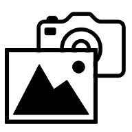

#  Image2Camera

An android "fake" camera app to select an image.

> 

The app offers a standard camera interface to deal with the capture photo intent,
but allow you to choose an exist image file instead.

The app is designed for Inrgess 1.77.0, which only allow user to submit portal by capture photos right now.
But it also works for the apps like this.
